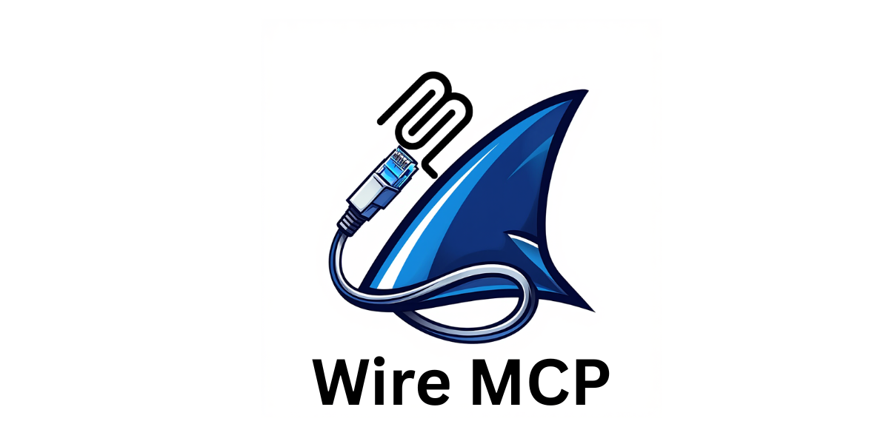

# WireMCP
WireMCP is a Model Context Protocol (MCP) server designed to empower Large Language Models (LLMs) with real-time network traffic analysis capabilities. By leveraging tools built on top of Wireshark's `tshark`, WireMCP captures and processes live network data, providing LLMs with structured context to assist in tasks like threat hunting, network diagnostics, and anomaly detection.

# Features
WireMCP exposes the following tools to MCP clients, enhancing LLM understanding of network activity:

- **`capture_packets`**: Captures live traffic and returns raw packet data as JSON, enabling LLMs to analyze packet-level details (e.g., IP addresses, ports, HTTP methods).
- **`get_summary_stats`**: Provides protocol hierarchy statistics, giving LLMs an overview of traffic composition (e.g., TCP vs. UDP usage).
- **`get_conversations`**: Delivers TCP/UDP conversation statistics, allowing LLMs to track communication flows between endpoints.
- **`check_threats`**: Captures IPs and checks them against the URLhaus blacklist, equipping LLMs with threat intelligence context for identifying malicious activity.
- **`check_ip_threats`**: Performs targeted threat intelligence lookups for specific IP addresses against multiple threat feeds, providing detailed reputation and threat data.


## How It Helps LLMs
WireMCP bridges the gap between raw network data and LLM comprehension by:
- **Contextualizing Traffic**: Converts live packet captures into structured outputs (JSON, stats) that LLMs can parse and reason about.
- **Threat Detection**: Integrates IOCs (currently URLhaus) to flag suspicious IPs, enhancing LLM-driven security analysis.
- **Diagnostics**: Offers detailed traffic insights, enabling LLMs to assist with troubleshooting or identifying anomalies.
- **Narrative Generation**: LLM's can Transform complex packet captures into coherent stories, making network analysis accessible to non-technical users.

# Installation

## Prerequisites
- Mac / Windows / Linux
- [Wireshark](https://www.wireshark.org/download.html) (with `tshark` installed and accessible in PATH)
- Node.js (v16+ recommended)
- npm (for dependency installation)

## Setup
1. Clone the repository:
   ```bash
   git clone https://github.com/0xkoda/WireMCP.git
   cd WireMCP
   ```

2. Install dependencies:
   ```bash
   npm install
   ```

3. Run the MCP server:
   ```bash
   node index.js
   ```

> **Note**: Ensure `tshark` is in your PATH. WireMCP will auto-detect it or fall back to common install locations (e.g., `/Applications/Wireshark.app/Contents/MacOS/tshark` on macOS).

# Usage with MCP Clients

WireMCP works with any MCP-compliant client. Below are examples for popular clients:

## Example 1: Cursor

Edit `mcp.json` in Cursor -> Settings -> MCP :

```json
{
  "mcpServers": {
    "wiremcp": {
      "command": "node",
      "args": [
        "/ABSOLUTE_PATH_TO/WireMCP/index.js"
      ]
    }
  }
}
```

**Location (macOS)**: `/Users/YOUR_USER/Library/Application Support/Claude/claude_desktop_config.json`

## Other Clients

This MCP will work well with any client. Use the command `node /path/to/WireMCP/index.js` in their MCP server settings.

# Example Output

Running `check_threats` might yield:

```
Captured IPs:
174.67.0.227
52.196.136.253

Threat check against URLhaus blacklist:
No threats detected in URLhaus blacklist.
```

Running `check_ip_threats` for specific IP analysis:

```
IP Threat Analysis:
Target IP: 192.168.1.100
Results:
- Reputation Score: 95/100 (Clean)
- Last Seen: 2024-03-27
- Known Services: Web hosting
- Threat Feeds: No matches found
- Geographic Location: United States
- ASN: AS12345 (Example Network)

Target IP: 203.0.113.1
Results:
- Reputation Score: 15/100 (Suspicious)
- Last Seen: 2024-03-28
- Known Activities: Port scanning
- Threat Feeds: Listed in 2 feeds
  * Emerging Threats (Category: Scanner)
  * AbuseIPDB (Reports: 15)
- Geographic Location: Unknown
- ASN: AS67890 (Anonymous Hosting Ltd.)
```

Running `analyze_pcap` with narrative analysis:

```
Network Activity Narrative:
During this capture period (14:23:45 - 14:24:15):
- Observed HTTP traffic to api.example.com (Port 443)
- Multiple DNS queries for cloud services
- Regular keepalive packets between local workstation and gateway
- Detected normal HTTPS handshakes with trusted certificates
- No suspicious patterns or anomalies detected in the traffic flow

Key Statistics:
- 75% HTTPS traffic
- 15% DNS queries
- 10% other protocols
```

LLMs can use these outputs to:
- Provide natural language explanations of network activity
- Identify patterns and potential security concerns
- Offer context-aware recommendations
- Generate human-readable reports

# Roadmap

- **Expand IOC Providers**: Currently uses URLhaus for threat checks. Future updates will integrate additional sources (e.g., IPsum, Emerging Threats) for broader coverage.


# Contributing

Contributions are welcome! Please feel free to submit a Pull Request. For major changes, please open an issue first to discuss what you would like to change.

# License

[MIT](LICENSE)

# Acknowledgments

- Wireshark/tshark team for their excellent packet analysis tools
- Model Context Protocol community for the framework and specifications
- URLhaus for providing threat intelligence data